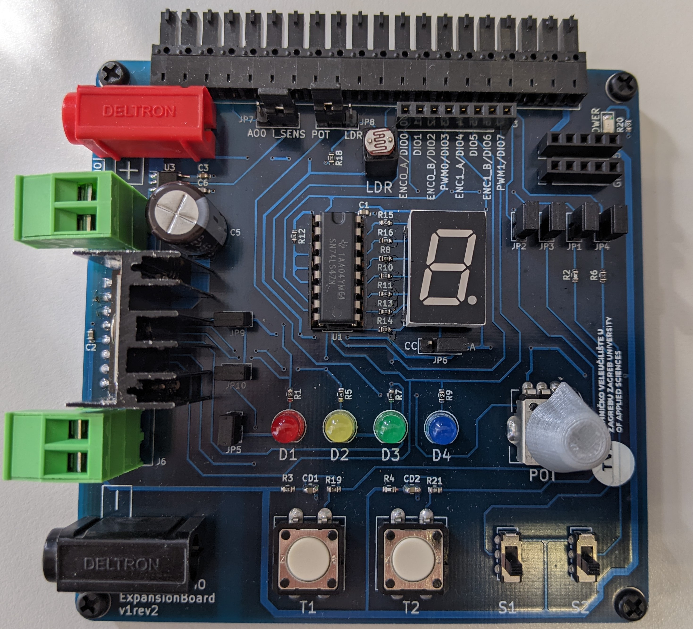

# myDAQ Expansion Board
 Expansion board for NI myDAQ Student Data Acquisition Device, developed in 2022 for students studying at Zagreb university of applied sciences.
 
 ## Features
 - Push buttons
 - Toggle switches
 - LEDs
 - BCD decoder for seven-segment display
 - L298n H-bridge used for powering two DC motors or one stepper motor
 - ACS712ELCTR-05B-T current sense IC for motor current measurement
 - External power supply
 - Potentiometer
 - Light dependent resistor

